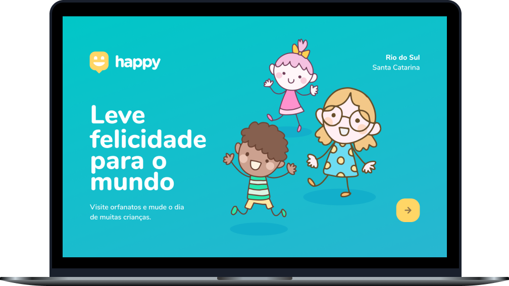

 

  

 

  

## 🚀 Technology

This project was developed with the following technologies:

- [Node.js](https://nodejs.org/en/)
- [Express](https://expressjs.com/pt-br/)
- [SQLite](https://www.sqlite.org/index.html)
- [Handlebars](https://handlebarsjs.com/)

## 💻 Project

Happy is an application that connects people to institutional care homes to make many children's day happier 💜

## 🔖 Layout

You can view the layout of the project through [this link](https://www.figma.com/file/mDEbnoojksG4w8sOxmudh3/Happy-Web).
## :memo: Licença

This project is under the MIT license.

<h4 align="center">
    Done with 💜 by <a href="https://www.linkedin.com/in/bruno-fernandes-517026187/" target="_blank">Bruno Fernandes</a>
</h4>
